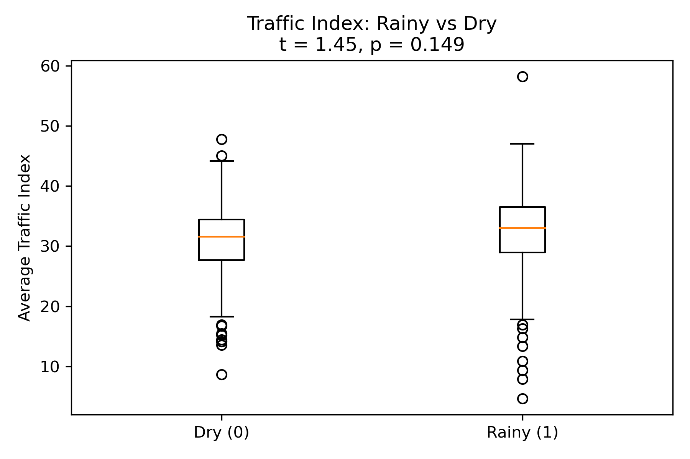
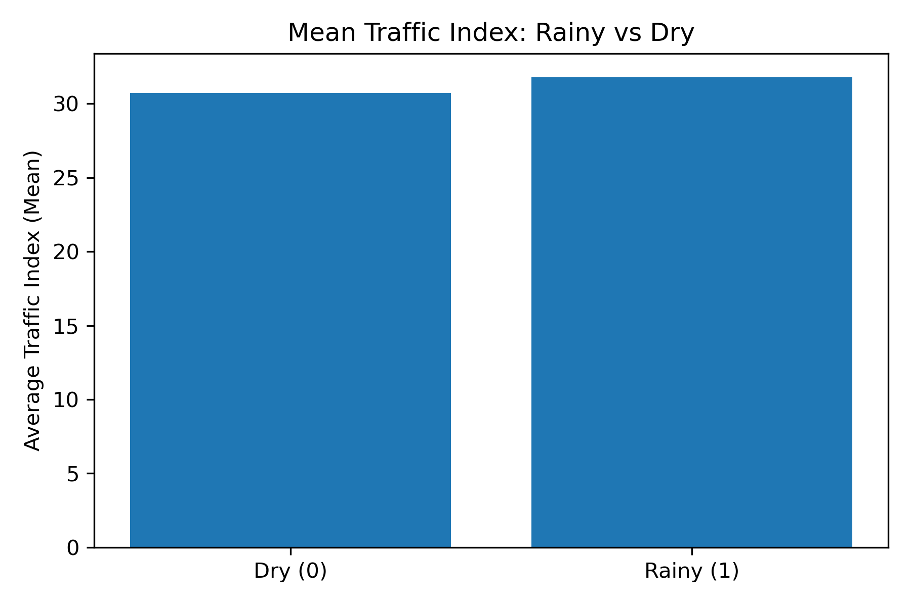
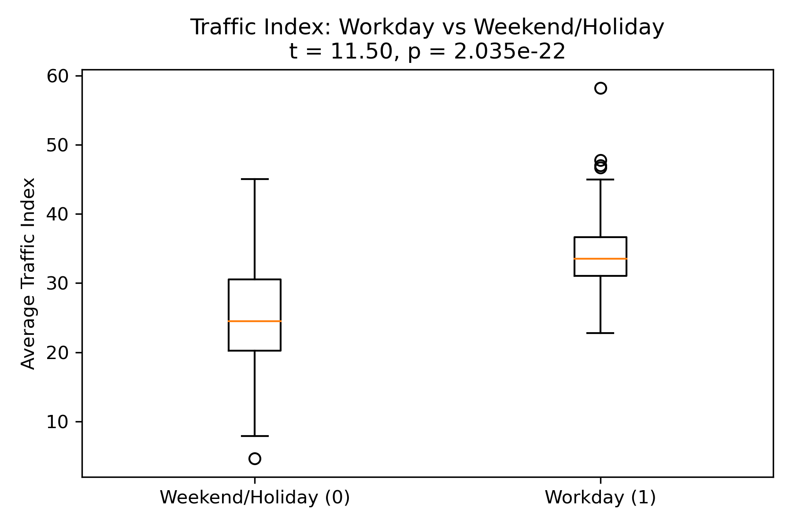
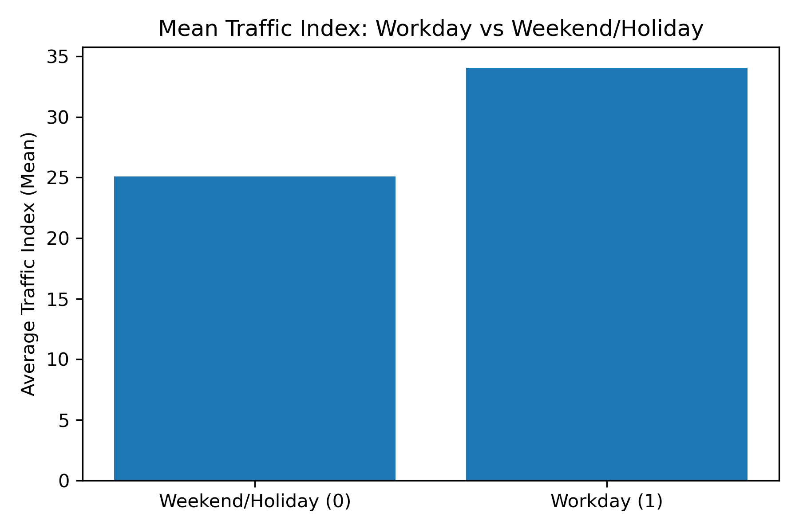
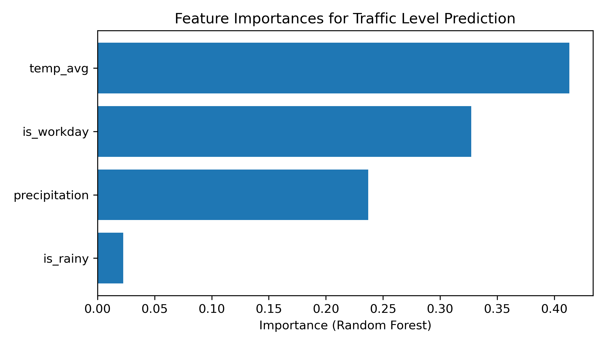
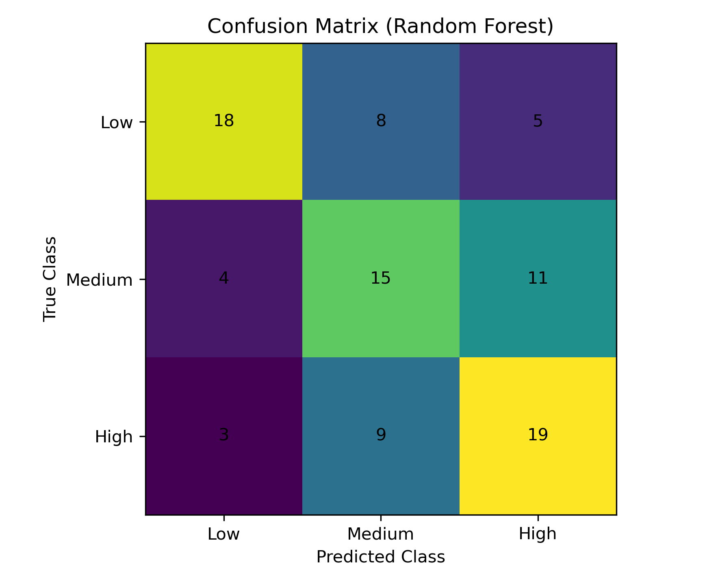

# DSA210 – Istanbul Mobility Project  
**Analyzing the Impact of Weather and Special Days on Istanbul Public Transport | DSA210 Fall 2025 Project**

---

## PROJECT SUMMARY
This project aims to search effects of special days and weather conditions to the public transportation.  
Main idea is to compare and merge daily passanger interference with daily weather conditions and special days and get meaningful pattern.

---

## MOTIVATION
Every day millions of people goes school, work or elsewhere by public transportation.  
But sometimes public transportation have huge human traffic, sometimes it changes to opposite way.  
Rainy weather, special holidays and weekends effect this situation more deeply.  
This project aims to understand dinamics of these type of changes.  
My aim is to provide effects of weather and special days to the public transportation with datas that I merged.  
In this way, I want to contribute to municipalities and transportation planners being able to anticipate such changes and make more efficient plans in the future.

---

## DATA SOURCES
The data I will use in this project will be publicly available.  
Data sources that I am gonna use:

1. **İBB Open Data Portal** – [Daily human traffic through public transportation](https://data.ibb.gov.tr/dataset/istanbul-trafik-indeksi)  
2. **OpenWeatherAPI** – [Daily temperature, rain information data for Istanbul](https://archive-api.open-meteo.com/v1/archive)  
3. **Public Holidays and Special Days Calendar** – National holidays and weekdends.

I am aiming to analyze these sources and merge collected data with timeline.

---

## DATA GATHERING AND PREPARATION PLAN
**Step 1:** From İBB open data portal I will download daily usage data of public transportation in Istanbul.  
**Step 2:** From openweather site I will gather Istanbul’s daily weather data.  
**Step 3:** I will create csv file which says when there is holiday.  
**Step 4:** Combining all this data on a historical basis and making it analyzable.  
**Step 5:** Cleaning up missing or erroneous records and extracting weekly and seasonal characteristics.  

At the end of these steps we have a dataset that includes:  
Every day passenger number + weather condition + holiday information.

---

## PLANNED ANALYZE STEPS
1. Seeing the change in daily passenger numbers over time (trend and seasonality analysis)  
2. Examine the relationship between weather and passenger numbers (For example: is there a drop in passenger numbers on rainy days?)  
3. To test whether there are station-based differences on public holidays and weekends  
4. Visualizing the findings with graphics.

---

## EXPECTED FINDINGS
I expect a decrease in passenger numbers on rainy days;  
a decrease at certain times on very hot days;  
a significant decrease on holidays or Sundays;  
and an increase on certain routes during special events (For example: match days).

---

## LIMITATIONS AND FUTURE STEPS
I do not currently have actual data.  
I have only completed the data sources and planning phase at this stage.  
I will begin data downloading, cleaning, and initial analysis in November.  

Time constraints, missing station data, or gaps in weather data may limit the accuracy of the analysis.

---

## FINAL NOTE
This project aims to offer a simple but effective data approach to understanding daily transportation habits in Istanbul.  
Instead of complex modeling, a relationship-based perspective based on explanation and visualization will be done.  
The code and outputs obtained throughout the process will be shared transparently on GitHub.

---

## HYPOTHESIS TESTING AND VISUALIZATION

Based on the data collected and analyzed, statistical t-tests were performed to validate the relationships between the variables. Visualizations were generated to inspect the distribution and mean differences.

### 1. Impact of Weather (Rain vs. Dry) on Passenger Numbers

To determine if rain significantly impacts public transport usage, we analyzed the daily passenger counts categorized by weather condition.

**Hypotheses:**
* **Null Hypothesis ($H_0$):** There is no significant difference in the average traffic index between rainy days and dry days. ($\mu_{rain} = \mu_{dry}$).
* **Alternative Hypothesis ($H_1$):** There is a significant difference in the average traffic index between rainy days and dry days. ($\mu_{rain} \neq \mu_{dry}$).

**Visual Analysis:**
Below, the boxplot and mean bar chart visualize the distribution and average passenger counts for rainy versus dry days.

**Statistical Test Results:**
* **t-statistic:** 1.446041830594893
* **p-value:** 0.14907454286848537

**Conclusion:**
Since the **p-value (0.149)** is greater than the standard significance level of $\alpha = 0.05$, we **fail to reject the Null Hypothesis**.

* **Interpretation:** Both the visual overlaps in the boxplot and the statistical test suggest that rain does not significantly alter traffix index in Istanbul. This indicates that daily commuting habits (work/school) are inelastic and continue regardless of precipitation.

---

### 2. Impact of Day Type (Workday vs. Weekend/Holiday)

To confirm the effect of business days versus off-days (weekends and public holidays), a similar analysis was conducted.

**Hypotheses:**
* **Null Hypothesis ($H_0$):** There is no significant difference in the traffic index between workdays and weekends/holidays ($\mu_{workday} = \mu_{weekend}$).
* **Alternative Hypothesis ($H_1$):** There is a significant difference in the traffic index between workdays and weekends/holidays ($\mu_{workday} \neq \mu_{weekend}$).

**Visual Analysis:**
The difference in usage intensity is clearly visible in the following plots.

**Statistical Test Results:**
* **t-statistic:** 11.499409613895953
* **p-value:** 2.0346914158481092e-22

**Conclusion:**
Since the **p-value ($2.03 \times 10^{-22}$)** is significantly lower than the significance level of $\alpha = 0.05$, we **reject the Null Hypothesis**.

* **Interpretation:** There is an extremely strong statistical difference between traffic index on workdays versus holidays. The boxplot shows a distinct separation in the medians, and the t-test confirms this difference is not due to chance. This confirms that the primary driver of traffic index in Istanbul is routine commuting, which drops drastically during off-days.

---

## MACHINE LEARNING ANALYSIS

After completing exploratory data analysis and hypothesis testing, a machine learning approach was applied to further investigate whether daily traffic congestion levels in Istanbul can be **predicted** using weather conditions and calendar information. Unlike hypothesis testing, which focuses on mean differences, machine learning evaluates the combined and non-linear effects of multiple variables simultaneously.

---

### Problem Definition

The goal of the machine learning task is to classify daily traffic conditions into congestion levels using available features.  
The continuous variable **average_traffic_index** was transformed into three balanced categories using quantile-based binning:

- **Low traffic**
- **Medium traffic**
- **High traffic**

This formulation results in a **multi-class classification problem**.

---

### Features Used

Due to data availability, the following features were included in the model:

- **temp_avg** – daily average temperature  
- **precipitation** – total daily precipitation  
- **is_rainy** – binary indicator (1 if precipitation > 0, else 0)  
- **is_workday** – binary indicator for workdays vs weekends/holidays  

These variables represent both **weather-related** and **human activity-related** factors.

---

### Model Selection

A **Random Forest Classifier** was selected for this task because:

- It captures **non-linear relationships**
- It performs well on **tabular datasets**
- It provides **feature importance scores**, improving interpretability

The dataset was split into **75% training** and **25% testing** sets using stratified sampling to preserve class balance.

---

### Model Performance

The classification performance on the test set is summarized below:

- **Overall accuracy:** 57%
- **Macro-average F1-score:** 0.57

#### Classification Report Summary

- **Low traffic** days are predicted with the highest precision (0.72)
- **Medium traffic** is the hardest class to predict, showing lower precision and recall
- **High traffic** predictions show moderate performance, with recall higher than precision

This pattern suggests that extreme traffic conditions (low or high congestion) are easier to identify than medium congestion levels.

---

### ML Visual Outputs

To make the ML results interpretable, two outputs were generated:

#### 1) Feature Importance Plot
This chart shows which variables contribute most to predicting traffic congestion level.

Based on the model, the most influential predictors are:
- **temp_avg (~41%)**
- **is_workday (~33%)**
- **precipitation (~24%)**
- **is_rainy (~2%)**

This supports the earlier statistical findings: workday patterns dominate congestion behavior, while rain presence alone (binary) is less informative than rain intensity.

#### 2) Confusion Matrix
The confusion matrix below shows how the model confuses different congestion levels.

Main observation: the model most frequently misclassifies the **Medium** class, indicating that daily traffic behaves like a continuum and borderline days are harder to separate into discrete levels.

### Confusion Matrix Interpretation

The confusion matrix indicates that:

- Misclassifications frequently occur between **Medium** and the other two classes
- The model rarely confuses **Low** traffic with **High** traffic directly

This implies that the traffic index behaves more like a **continuum**, where borderline days are harder to classify precisely.

---

### Feature Importance Analysis

The Random Forest model provides the following feature importance ranking:

1. **temp_avg** (41.3%)
2. **is_workday** (32.7%)
3. **precipitation** (23.7%)
4. **is_rainy** (2.2%)

#### Interpretation

- **Workday status** is one of the strongest predictors, confirming findings from hypothesis testing that routine commuting dominates traffic behavior.
- **Temperature** has a notable influence, possibly reflecting seasonal patterns and behavioral changes.
- **Precipitation** contributes meaningfully, but its binary form (**is_rainy**) has limited explanatory power, indicating that **rain intensity** matters more than the mere presence of rain.

---

### Relation to Statistical Findings

The machine learning results are consistent with earlier hypothesis testing:

- Rain alone does not strongly determine traffic behavior
- Calendar effects (workday vs holiday) remain the dominant driver
- Traffic congestion emerges from **combined effects**, rather than a single variable

Thus, ML complements hypothesis testing by demonstrating how these factors interact non-linearly.

---

### Limitations and Future Work

- The model is trained on a limited set of weather variables
- No temporal dependencies (lags, trends) are included
- External factors such as accidents, public events, or infrastructure changes are not captured

Future improvements may include:
- Time-series features (lagged traffic index)
- Additional weather indicators (humidity, wind)
- Advanced models such as Gradient Boosting or LSTM networks

---

### Final Remark

The machine learning analysis shows that while traffic congestion in Istanbul is difficult to predict perfectly, **workday patterns and weather conditions together provide meaningful predictive signals**. These findings reinforce the importance of integrating calendar awareness into urban transportation planning.

